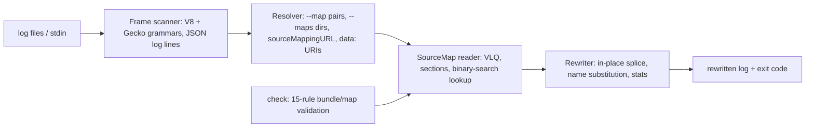

# remaptrace

[English](README.md) | [中文](README.zh.md) | [日本語](README.ja.md)

[](LICENSE)   [](CONTRIBUTING.md)

**minify された JS スタックトレースに source map をバッチ適用——ログファイルを丸ごと入れると読めるトレースが出てくる。完全オフライン、bundle/map 整合性チェック付き。**


```bash
# not yet on npm — install from a checkout of this repository
npm install && npm run build && npm pack
npm install -g ./remaptrace-0.1.0.tgz
```

## なぜ remaptrace？

どの JavaScript チームも、エラートラッキングサービスを導入する前（あるいは導入しない代わり）に必ずこの場面に出くわす：本番で例外が飛び、ログには `at d (app.min.js:1:36)` としか書かれていない。解読できる source map は `dist/` にちゃんとあるのに、ツールの空白は現実に存在する——ブラウザ devtools は自分のページのライブなトレースしかシンボル化せず、stacktracify はクリップボードからトレースを 1 本ずつ貼り付ける対話操作が前提で、エラートラッキングサービスは map を先方のインフラへアップロードしないと何も見せてくれない。昨夜の 200 MB のログファイルを受け取って読める形で返してくれるものは 1 つもない。remaptrace はまさにそれをやる：ログファイル全体（または stdin）を走査し、行のどこにあっても V8 と Firefox/Safari 両方のフレームを認識——JSON ログ行の文字列内にエスケープされたスタックも含めて——ローカルの `.map` ファイルでフレームをその場で書き換え、それ以外のバイトは無傷で通す。出力はそのまま grep も diff もできる。そしてシンボル化を静かに壊すのは古い map や取り違えた map なので、`remaptrace check` が安定コード 15 規則で bundle/map の組を、事故が起きる前に検証する。

|  | remaptrace | stacktracify | エラートラッキング（例：Sentry） | ブラウザ devtools |
|---|---|---|---|---|
| ログファイルを丸ごとバッチ処理 | はい、それが本業 | いいえ——貼り付け 1 本ずつ | 取り込みパイプラインであり、手元のログは対象外 | いいえ |
| JSON ログ行内のスタック | はい、その場で書き換え | いいえ | 対象外 | いいえ |
| オフライン動作・インフラ不要 | はい——ソケットを一切開かない | はい | いいえ——同社サービスが前提 | はい、ただしライブページのみ |
| bundle/map 整合性の検証 | 安定コード 15 規則の `check` | いいえ | 部分的、アップロード時のみ | いいえ |
| フレーム以外のバイトを保持 | バイト単位でそのまま通過 | 対象外 | 対象外 | 対象外 |
| ランタイム依存 | 0 | 直接依存 4 個（2026-07） | サービス一式 | 対象外 |

<sub>各ツールの能力は公開ドキュメントに照らして確認、2026-07。</sub>

## 特長

- **バッチ前提の設計** — ログファイル丸ごと、`--maps` ディレクトリ、パイプ、どれでも投入可能。認識されたフレームはその場で書き換え、それ以外（タイムスタンプ、リクエスト id、平文）はバイト単位で保持。
- **JSON ログ行は第一級市民** — オブジェクト行はパースされ、文字列値内のスタック（入れ子のオブジェクトや配列も含む）が再マップされ、キー順を保って再出力される。`--no-json-lines` で無効化可能。
- **両方のトレース文法に対応** — V8/Chrome/Node（`at fn (url:1:2)`、`async`/`new`/`[as alias]` 修飾、eval 位置フレーム）と Firefox/Safari（`fn@url:1:2`、`global code`）。行内のどの位置でも一致し、URL のポートも正しく扱う。
- **誠実な解決、厳格にオフライン** — 明示の `--map bundle=map` ペア、`--maps` ディレクトリ索引（まずファイル名、次に map の `file` フィールド）、`sourceMappingURL` コメントとインライン base64 `data:` URI。`https://` のバンドル URL は決して取得せず、マップできないフレームはそのまま通し、`--stats` が何が欠けたかを名指しする。
- **map/bundle 検証を内蔵** — `check` は古い map の兆候（バンドル末尾を越えるマッピング）、取り違え、`sourcesContent` 欠落、壊れた VLQ、インデックス破損を捕まえる：E1xx/W2xx/I3xx コード、所見ごとの具体的な直し方、`--fail-on` ゲート、`--format json`。
- **依存ゼロ、エンジン級のテスト** — 仕様から実装した source-map リーダー（VLQ、indexed map、`sourceRoot`、名前置換）を素の TypeScript で。90 テストとエンドツーエンドの smoke スクリプト、ネットワークは一切なし。

## クイックスタート

同梱のサンプルログを maps ディレクトリに対して再マップする：

```bash
remaptrace remap examples/logs/prod.log --maps examples/dist --stats
```

出力（実際にキャプチャした実行結果）：

```text
2026-07-12T09:14:03.184Z ERROR checkout failed for order 84213
Error: unknown discount code: WINTER25
    at applyDiscount (src/checkout.js:6:5)
    at computeTotal (src/checkout.js:12:22)
    at handleCheckout (src/main.js:5:17)
    at processTicksAndRejections (node:internal/process/task_queues:95:5)
2026-07-12T09:14:03.190Z INFO retry scheduled for order 84213
{"level":"error","ts":"2026-07-12T09:15:11.402Z","msg":"unhandled rejection","stack":"Error: unknown discount code: WINTER25\n    at applyDiscount (src/checkout.js:6:5)\n    at computeTotal (src/checkout.js:12:22)"}
2026-07-12T09:16:42.001Z ERROR third-party widget crashed
    at t (https://cdn.example.test/assets/vendor.min.js:1:9101)
2026-07-12T09:17:05.330Z WARN trace reported by a Firefox client:
computeTotal@src/checkout.js:12:22
handleCheckout@src/main.js:5:17
```

stderr にはサマリ：`remaptrace: 9 frame(s) found, 7 remapped, 1 unmapped, 1 unresolved (no map for: https://cdn.example.test/assets/vendor.min.js ×1); 1 JSON line(s) rewritten`。vendor のバンドルには map がないためフレームはそのまま通過する——remaptrace は劣化はしても推測はしない。1 箇所だけ調べる場合、ソースの前後は `sourcesContent` から表示される：

```bash
remaptrace frame app.min.js:1:36 --maps examples/dist
```

```text
app.min.js:1:36
  → src/checkout.js:6:5 (applyDiscount)

    4 |   const rule = RULES[code];
    5 |   if (!rule) {
  > 6 |     throw new Error(`unknown discount code: ${code}`);
    7 |   }
    8 |   return cart.items.map((item) => rule.apply(item));
```

さらにデプロイのパイプラインで、事故の前に：`remaptrace check dist/` は map が古い・取り違えている場合に終了コード 1 で失敗する（`examples/broken` が E105、W202、W205、W206 を実演）。その他のシナリオは [examples/](examples/README.md) に。

## CLI リファレンス

`remap` がデフォルトコマンド。`frame` は 1 位置の照会、`check` は bundle と map の検証、`inspect` は map のサマリ表示。

| フラグ | デフォルト | 効果 |
|---|---|---|
| `-m, --maps <dir>` | — | `.map` ファイルのディレクトリ、繰り返し可。まずファイル名、次に `file` フィールドで索引 |
| `--map <js=map>` | — | bundle と map の明示ペア、繰り返し可。URL・パス接尾辞・ファイル名で一致 |
| `-o, --output <file>` | stdout | remap：書き換え後のログをここへ出力 |
| `--stats` | オフ | remap：stderr に 1 行サマリ（発見/再マップ/未マップ/未解決） |
| `--fail-unmapped` | オフ | remap：minify のまま残ったフレームがあれば終了コード 1 |
| `--no-json-lines` | オフ | remap：JSON ログ行を平文として扱う |
| `-c, --context <n>` | `2` | frame：`sourcesContent` から出すソース前後の行数 |
| `--fail-on <level>` | `warning` | check ゲート：`error`、`warning`、`info`、`never` |
| `--format text\|json` | `text` | frame/check/inspect：機械可読出力 |
| `-q, --quiet` | オフ | 必須でない出力を抑制（統計行、合格時の `check` レポート） |

終了コード：`0` 成功、`1` 所見あり（またはゲートに掛かった未マップフレーム）、`2` 使い方・入力エラー——パイプラインはビルドの故障とコマンドの打ち間違いを区別できる。map の解決順序と規則カタログの全文は [docs/map-resolution.md](docs/map-resolution.md) と [docs/check-rules.md](docs/check-rules.md) に。

## アーキテクチャ



## ロードマップ

- [x] JSON ログ行対応のバッチ再マップ、両トレース文法、オフライン map 解決、`frame`/`check`/`inspect`、15 規則の検証カタログ、統計と CI ゲート（v0.1.0）
- [ ] ストリーミングモード：`tail -f` でライブログを到着順に再マップ
- [ ] 呼び出し元を考慮した命名：エラートラッキングサービスのように、下のフレームの呼び出し位置から関数名を導出
- [ ] 再帰的 `check` とデプロイマニフェスト（期待される bundle/map ペアとハッシュ）
- [ ] 文法の追加：Hermes/React Native トレースと async スタック区切り

全リストは [open issues](https://github.com/JaydenCJ/remaptrace/issues) を参照。

## コントリビュート

コントリビューション歓迎。`npm install && npm run build` でビルドし、`npm test`（90 テスト）と `bash scripts/smoke.sh`（`SMOKE OK` の表示が必須）を実行——このリポジトリは CI を持たず、上記の主張はすべてローカル実行で検証されている。[CONTRIBUTING.md](CONTRIBUTING.md) を読み、[good first issue](https://github.com/JaydenCJ/remaptrace/issues?q=is%3Aissue+is%3Aopen+label%3A%22good+first+issue%22) を選ぶか、[discussion](https://github.com/JaydenCJ/remaptrace/discussions) を始めてほしい。

## ライセンス

[MIT](LICENSE)
