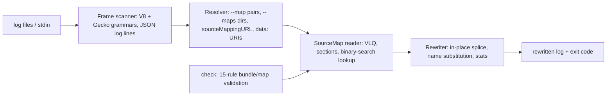

# remaptrace

[English](README.md) | [中文](README.zh.md) | [日本語](README.ja.md)

[](LICENSE)   [](CONTRIBUTING.md)

**Apply source maps to minified JS stack traces in batch — whole log files in, readable traces out, fully offline, with bundle/map consistency checks.**


```bash
# not yet on npm — install from a checkout of this repository
npm install && npm run build && npm pack
npm install -g ./remaptrace-0.1.0.tgz
```

## Why remaptrace?

Every JavaScript team hits this before (or instead of) adopting an error-tracking service: production throws, and the log says `at d (app.min.js:1:36)`. The source map that could decode it is sitting right there in `dist/`, but the tooling gap is real — browser devtools only symbolicate their own live traces, stacktracify is built around pasting one trace at a time from the clipboard, and error trackers want you to upload maps to their infrastructure before showing you anything. None of them will take last night's 200 MB log file and give it back readable. remaptrace does exactly that: it scans whole log files (or stdin), recognizes V8 and Firefox/Safari frames anywhere in a line — including stacks escaped inside JSON log lines — rewrites each frame in place using local `.map` files, and passes every other byte through untouched, so the output stays greppable and diffable. And because the silent killer of symbolication is a stale or mismatched map, `remaptrace check` validates bundle/map pairs with 15 stable-coded rules before you need them in an incident.

|  | remaptrace | stacktracify | error trackers (e.g. Sentry) | browser devtools |
|---|---|---|---|---|
| Whole log files in batch | yes, that is the point | no — one pasted trace | ingest pipeline, not your log files | no |
| Stacks inside JSON log lines | yes, rewritten in place | no | n/a | no |
| Works offline, zero infrastructure | yes — never opens a socket | yes | no — requires their service | yes, but live pages only |
| Validates bundle/map consistency | 15-rule `check` with stable codes | no | partial, at upload time | no |
| Non-frame log bytes preserved | byte-identical pass-through | n/a | n/a | n/a |
| Runtime dependencies | 0 | 4 direct (2026-07) | a service | n/a |

<sub>Capability notes checked against each tool's public documentation, 2026-07.</sub>

## Features

- **Batch by design** — feed it whole log files, directories of `--maps`, or a pipe; every recognized frame is rewritten in place and everything else (timestamps, request ids, prose) survives byte-identical.
- **JSON log lines are first-class** — object lines are parsed, stacks inside string values (nested objects and arrays included) are remapped, and the line is re-emitted with key order preserved; `--no-json-lines` opts out.
- **Both trace grammars** — V8/Chrome/Node (`at fn (url:1:2)`, `async`/`new`/`[as alias]` decorations, eval-site frames) and Firefox/Safari (`fn@url:1:2`, `global code`), matched anywhere in a line, URL ports handled.
- **Honest resolution, strictly offline** — explicit `--map bundle=map` pairs, `--maps` directory indexing (by filename, then by the map's `file` field), `sourceMappingURL` comments and inline base64 `data:` URIs; `https://` bundle URLs are never fetched, and unmapped frames pass through with `--stats` naming what was missing.
- **Map/bundle validation built in** — `check` catches the stale-map signature (mappings past the end of the bundle), wrong pairings, missing `sourcesContent`, corrupt VLQ and index corruption: E1xx/W2xx/I3xx codes, a concrete fix per finding, `--fail-on` gate, `--format json`.
- **Zero dependencies, engine-grade tests** — a from-spec source-map reader (VLQ, indexed maps, `sourceRoot`, name substitution) in plain TypeScript; 90 tests plus an end-to-end smoke script, no network anywhere.

## Quickstart

Remap the bundled example log against its maps directory:

```bash
remaptrace remap examples/logs/prod.log --maps examples/dist --stats
```

Output (real captured run):

```text
2026-07-12T09:14:03.184Z ERROR checkout failed for order 84213
Error: unknown discount code: WINTER25
    at applyDiscount (src/checkout.js:6:5)
    at computeTotal (src/checkout.js:12:22)
    at handleCheckout (src/main.js:5:17)
    at processTicksAndRejections (node:internal/process/task_queues:95:5)
2026-07-12T09:14:03.190Z INFO retry scheduled for order 84213
{"level":"error","ts":"2026-07-12T09:15:11.402Z","msg":"unhandled rejection","stack":"Error: unknown discount code: WINTER25\n    at applyDiscount (src/checkout.js:6:5)\n    at computeTotal (src/checkout.js:12:22)"}
2026-07-12T09:16:42.001Z ERROR third-party widget crashed
    at t (https://cdn.example.test/assets/vendor.min.js:1:9101)
2026-07-12T09:17:05.330Z WARN trace reported by a Firefox client:
computeTotal@src/checkout.js:12:22
handleCheckout@src/main.js:5:17
```

with the summary on stderr: `remaptrace: 9 frame(s) found, 7 remapped, 1 unmapped, 1 unresolved (no map for: https://cdn.example.test/assets/vendor.min.js ×1); 1 JSON line(s) rewritten`. The vendor bundle has no map, so its frame passes through untouched — remaptrace degrades, it never guesses. One position, with source context pulled from `sourcesContent`:

```bash
remaptrace frame app.min.js:1:36 --maps examples/dist
```

```text
app.min.js:1:36
  → src/checkout.js:6:5 (applyDiscount)

    4 |   const rule = RULES[code];
    5 |   if (!rule) {
  > 6 |     throw new Error(`unknown discount code: ${code}`);
    7 |   }
    8 |   return cart.items.map((item) => rule.apply(item));
```

And in the deploy pipeline, before the incident: `remaptrace check dist/` exits 1 on a stale or mismatched pair (`examples/broken` demonstrates E105, W202, W205, W206). More scenarios live in [examples/](examples/README.md).

## CLI reference

`remap` is the default command; `frame` looks up one position; `check` validates bundles and maps; `inspect` summarizes a map.

| Flag | Default | Effect |
|---|---|---|
| `-m, --maps <dir>` | — | directory of `.map` files, repeatable; indexed by name, then by `file` field |
| `--map <js=map>` | — | explicit bundle-to-map pairing, repeatable; matches URL, path suffix or basename |
| `-o, --output <file>` | stdout | remap: write the rewritten log here |
| `--stats` | off | remap: one-line summary to stderr (found / remapped / unmapped / unresolved) |
| `--fail-unmapped` | off | remap: exit 1 if any frame stayed minified |
| `--no-json-lines` | off | remap: treat JSON log lines as plain text |
| `-c, --context <n>` | `2` | frame: source context lines from `sourcesContent` |
| `--fail-on <level>` | `warning` | check gate: `error`, `warning`, `info` or `never` |
| `--format text\|json` | `text` | frame/check/inspect: machine-readable output |
| `-q, --quiet` | off | suppress non-essential output (stats lines, passing `check` reports) |

Exit codes: `0` success, `1` findings or gated unmapped frames, `2` usage or input error — a pipeline can tell a broken build from a broken invocation. Map resolution order and the full rule catalog are documented in [docs/map-resolution.md](docs/map-resolution.md) and [docs/check-rules.md](docs/check-rules.md).

## Architecture



## Roadmap

- [x] Batch remap with JSON log lines, both trace grammars, offline map resolution, `frame`/`check`/`inspect`, 15-rule validation catalog, stats and CI gates (v0.1.0)
- [ ] Streaming mode: `tail -f` a live log and remap as lines arrive
- [ ] Caller-aware naming: derive a frame's function name from the call site below it, the way error trackers do
- [ ] Recursive `check` with a deploy manifest (expected bundle/map pairs and hashes)
- [ ] More grammars: Hermes/React Native traces and async stack separators

See the [open issues](https://github.com/JaydenCJ/remaptrace/issues) for the full list.

## Contributing

Contributions are welcome. Build with `npm install && npm run build`, then run `npm test` (90 tests) and `bash scripts/smoke.sh` (must print `SMOKE OK`) — this repository ships no CI, every claim above is verified by local runs. See [CONTRIBUTING.md](CONTRIBUTING.md), grab a [good first issue](https://github.com/JaydenCJ/remaptrace/issues?q=is%3Aissue+is%3Aopen+label%3A%22good+first+issue%22), or start a [discussion](https://github.com/JaydenCJ/remaptrace/discussions).

## License

[MIT](LICENSE)
