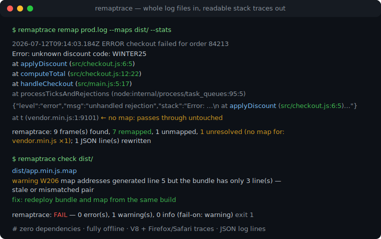
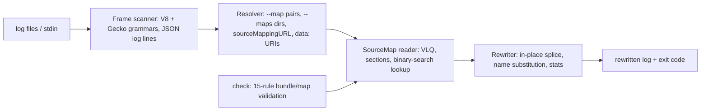

# remaptrace

[English](README.md) | [中文](README.zh.md) | [日本語](README.ja.md)

[](LICENSE)   [](CONTRIBUTING.md)

**批量把 source map 应用到压缩后的 JS 堆栈——整份日志文件进、可读堆栈出，完全离线，并自带 bundle/map 一致性校验。**



```bash
# not yet on npm — install from a checkout of this repository
npm install && npm run build && npm pack
npm install -g ./remaptrace-0.1.0.tgz
```

## 为什么选 remaptrace？

每个 JavaScript 团队在接入（或干脆不接）错误追踪服务之前都会撞上这一幕：生产环境抛错，日志里只有 `at d (app.min.js:1:36)`。能解开它的 source map 就躺在 `dist/` 里，但工具链的缺口是真实存在的——浏览器 devtools 只符号化自己页面上的实时堆栈，stacktracify 的交互围绕从剪贴板粘贴单条堆栈设计，错误追踪服务则要求先把 map 上传到它们的基础设施才给你看结果。没有一个工具愿意吃下昨晚那份 200 MB 的日志文件再还你一份可读的。remaptrace 做的正是这件事：扫描整份日志文件（或 stdin），在任意一行的任意位置识别 V8 与 Firefox/Safari 两种帧格式——包括转义在 JSON 日志行字符串里的堆栈——用本地 `.map` 文件原地重写每一帧，其余字节原样通过，输出依旧可 grep、可 diff。而符号化最隐蔽的杀手是过期或配错的 map，所以 `remaptrace check` 用 15 条稳定编码的规则在事故发生之前校验 bundle/map 配对。

|  | remaptrace | stacktracify | 错误追踪服务（如 Sentry） | 浏览器 devtools |
|---|---|---|---|---|
| 批量处理整份日志 | 是，这正是它的使命 | 否——每次粘贴一条 | 是摄取管道，不管你的日志文件 | 否 |
| JSON 日志行里的堆栈 | 是，原地重写 | 否 | 不适用 | 否 |
| 离线运行、零基础设施 | 是——从不打开 socket | 是 | 否——依赖其服务 | 是，但仅限在线页面 |
| 校验 bundle/map 一致性 | 15 条稳定编码规则的 `check` | 否 | 部分，在上传时 | 否 |
| 非堆栈字节原样保留 | 逐字节通过 | 不适用 | 不适用 | 不适用 |
| 运行时依赖 | 0 | 4 个直接依赖（2026-07） | 一整套服务 | 不适用 |

<sub>各工具能力依据其公开文档核对，2026-07。</sub>

## 功能

- **为批量而生** — 喂给它整份日志文件、`--maps` 目录或一条管道；每个被识别的帧原地重写，其余内容（时间戳、请求 id、普通文本）逐字节保留。
- **JSON 日志行是一等公民** — 对象行会被解析，字符串值里的堆栈（含嵌套对象与数组）被重映射，重新输出时保持键序；`--no-json-lines` 可关闭。
- **两种堆栈语法全覆盖** — V8/Chrome/Node（`at fn (url:1:2)`、`async`/`new`/`[as alias]` 修饰、eval 位置帧）与 Firefox/Safari（`fn@url:1:2`、`global code`），行内任意位置匹配，URL 端口正确处理。
- **诚实解析、严格离线** — 显式 `--map bundle=map` 配对、`--maps` 目录索引（先按文件名、再按 map 的 `file` 字段）、`sourceMappingURL` 注释与内联 base64 `data:` URI；`https://` 的 bundle URL 从不抓取，映射不了的帧原样通过，`--stats` 会点名缺了什么。
- **内置 map/bundle 校验** — `check` 能抓住过期 map 的签名（映射越过 bundle 末尾）、错误配对、缺失 `sourcesContent`、损坏的 VLQ 与索引错乱：E1xx/W2xx/I3xx 编码、每条发现都附具体修法、`--fail-on` 闸门、`--format json`。
- **零依赖、引擎级测试** — 纯 TypeScript 按规范实现的 source-map 读取器（VLQ、索引 map、`sourceRoot`、名称替换）；90 个测试加端到端 smoke 脚本，全程无网络。

## 快速上手

用自带的示例日志和它的 maps 目录跑一次重映射：

```bash
remaptrace remap examples/logs/prod.log --maps examples/dist --stats
```

输出（真实捕获的运行结果）：

```text
2026-07-12T09:14:03.184Z ERROR checkout failed for order 84213
Error: unknown discount code: WINTER25
    at applyDiscount (src/checkout.js:6:5)
    at computeTotal (src/checkout.js:12:22)
    at handleCheckout (src/main.js:5:17)
    at processTicksAndRejections (node:internal/process/task_queues:95:5)
2026-07-12T09:14:03.190Z INFO retry scheduled for order 84213
{"level":"error","ts":"2026-07-12T09:15:11.402Z","msg":"unhandled rejection","stack":"Error: unknown discount code: WINTER25\n    at applyDiscount (src/checkout.js:6:5)\n    at computeTotal (src/checkout.js:12:22)"}
2026-07-12T09:16:42.001Z ERROR third-party widget crashed
    at t (https://cdn.example.test/assets/vendor.min.js:1:9101)
2026-07-12T09:17:05.330Z WARN trace reported by a Firefox client:
computeTotal@src/checkout.js:12:22
handleCheckout@src/main.js:5:17
```

stderr 上是摘要：`remaptrace: 9 frame(s) found, 7 remapped, 1 unmapped, 1 unresolved (no map for: https://cdn.example.test/assets/vendor.min.js ×1); 1 JSON line(s) rewritten`。vendor 那个 bundle 没有 map，它的帧原样通过——remaptrace 只降级，从不瞎猜。查单个位置，源码上下文取自 `sourcesContent`：

```bash
remaptrace frame app.min.js:1:36 --maps examples/dist
```

```text
app.min.js:1:36
  → src/checkout.js:6:5 (applyDiscount)

    4 |   const rule = RULES[code];
    5 |   if (!rule) {
  > 6 |     throw new Error(`unknown discount code: ${code}`);
    7 |   }
    8 |   return cart.items.map((item) => rule.apply(item));
```

再在部署流水线里、事故之前：`remaptrace check dist/` 在 map 过期或配错时以退出码 1 失败（`examples/broken` 演示了 E105、W202、W205、W206）。更多场景见 [examples/](examples/README.md)。

## CLI 参考

`remap` 是默认命令；`frame` 查询单个位置；`check` 校验 bundle 与 map；`inspect` 输出 map 摘要。

| 参数 | 默认值 | 作用 |
|---|---|---|
| `-m, --maps <dir>` | — | `.map` 文件目录，可重复；先按文件名索引，再按 `file` 字段 |
| `--map <js=map>` | — | 显式 bundle 到 map 的配对，可重复；按 URL、路径后缀或文件名匹配 |
| `-o, --output <file>` | stdout | remap：把重写后的日志写到这里 |
| `--stats` | 关 | remap：向 stderr 输出单行摘要（发现/重映射/未映射/未解析） |
| `--fail-unmapped` | 关 | remap：只要有帧仍是压缩态就以退出码 1 结束 |
| `--no-json-lines` | 关 | remap：把 JSON 日志行当普通文本处理 |
| `-c, --context <n>` | `2` | frame：从 `sourcesContent` 取的源码上下文行数 |
| `--fail-on <level>` | `warning` | check 闸门：`error`、`warning`、`info` 或 `never` |
| `--format text\|json` | `text` | frame/check/inspect：机器可读输出 |
| `-q, --quiet` | 关 | 抑制非必要输出（统计行、通过时的 `check` 报告） |

退出码：`0` 成功，`1` 有发现或被闸门拦下的未映射帧，`2` 用法或输入错误——流水线能分清是构建坏了还是命令敲错了。map 的解析顺序与完整规则目录见 [docs/map-resolution.md](docs/map-resolution.md) 和 [docs/check-rules.md](docs/check-rules.md)。

## 架构



## 路线图

- [x] 批量重映射（含 JSON 日志行）、两种堆栈语法、离线 map 解析、`frame`/`check`/`inspect`、15 条校验规则目录、统计与 CI 闸门（v0.1.0）
- [ ] 流式模式：`tail -f` 实时日志，边到边重映射
- [ ] 调用方感知命名：像错误追踪服务那样，用下一帧的调用点推导函数名
- [ ] 递归 `check` 与部署清单（预期的 bundle/map 配对及哈希）
- [ ] 更多语法：Hermes/React Native 堆栈与 async 堆栈分隔符

完整列表见 [open issues](https://github.com/JaydenCJ/remaptrace/issues)。

## 贡献

欢迎贡献。先 `npm install && npm run build` 构建，然后跑 `npm test`（90 个测试）和 `bash scripts/smoke.sh`（必须打印 `SMOKE OK`）——本仓库不带 CI，上面的每一条主张都靠本地运行验证。请阅读 [CONTRIBUTING.md](CONTRIBUTING.md)，认领一个 [good first issue](https://github.com/JaydenCJ/remaptrace/issues?q=is%3Aissue+is%3Aopen+label%3A%22good+first+issue%22)，或发起一个 [discussion](https://github.com/JaydenCJ/remaptrace/discussions)。

## 许可证

[MIT](LICENSE)
